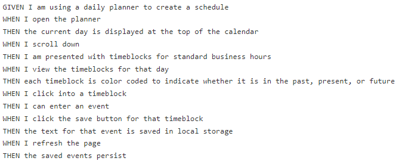
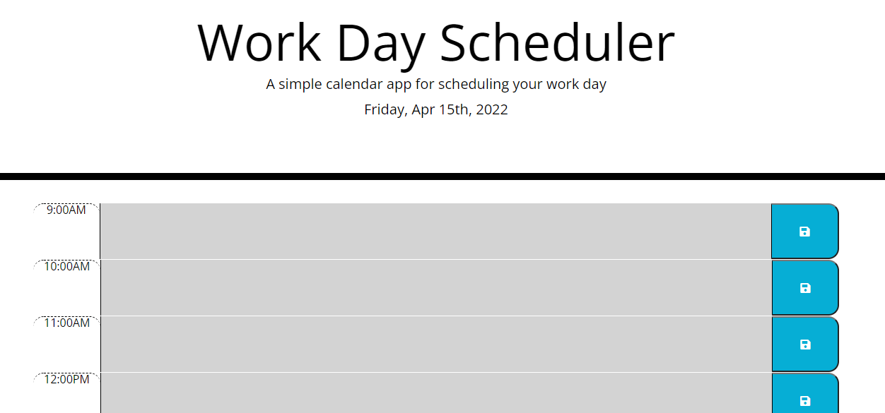

# Work-Day-Scheduler

## **Deployed Application**

Click on the following link to be navigated to the deployed website: https://luccaloopz.github.io/Work-Day-Scheduler/

## **Description**

This site is essentially a business planner. Users have the option to write text within each business hour's time-block. If they click the save button for the respective time-block, the text is saved to local storage so that once they refresh the page, the text sticks to the text area upon page load. 

## **Acceptance Criteria**

See below:



## **Languages Used**

* HTML
* CSS
* JavaScript 

## **Application**



## **Important Code Snippets**

I want to bring attention to a unique feature of the site. Please see below.

Although the below for-loop housed a number of other functionalities, one key functionality was the changing of colors of each time-row based on if the current time was less than, greater than, or equal to the hour associated with that row's time-block. If the time-block's hour already passed then its background is assigned the color grey, if the time-block's hour is still yet to come, it is assigned the color green, and if it equals the current hour then it is assigned the color red.

```JavaScript
var timeArray = ["9:00AM", "10:00AM", "11:00AM", "12:00PM", "1:00PM", "2:00PM", "3:00PM", "4:00PM", "5:00PM"];

var hourOfDay = moment().hour();

for (i = 0; i < timeArray.length; i++) {
    var time = moment(timeArray[i], "LT").format("HH");
    if (time > hourOfDay) {
        textarea.addClass("future");
        console.log(time);
    } else if (time < hourOfDay){
        textarea.addClass("past");
        console.log(time);
    } else {
        textarea.addClass("present");
        console.log(time);
    }
}
```